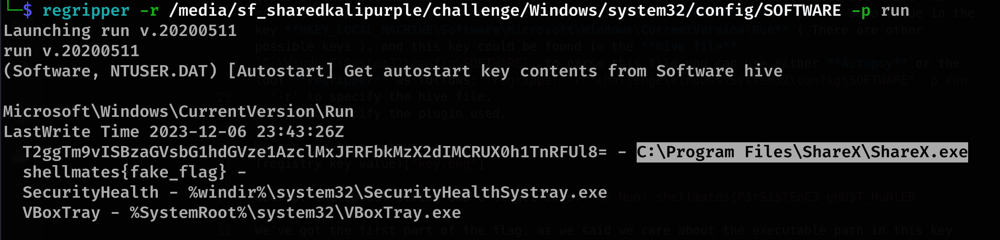
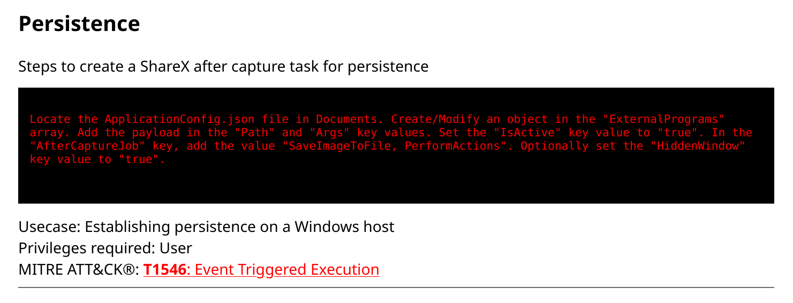
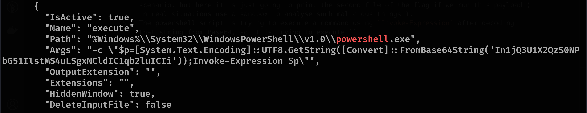

# Ghostware - Forensics

## Description

A ghost came to our home; he is hiding everywhere... everywhere. We can't find it! Maybe it's because he is living off the land?  
Find the two parts of the flag.  
zip file link: https://drive.google.com/file/d/1GC6NJbg9RYDcncmHGZXRoRO1-U2XIIpi/view?usp=sharing
zip file password: ctf  
zip file md5 checksum: 185eab8ae5be0c69d00d478d6d22a886  

## Quick overview

So we have a disk image for an infected machine, from the hints and the challenge name we can understand that the malware is using some kind of **persistence techniques** to hide and persist in the target system. The goal of this challenge is to find out these techniques so we can exclude the malware completely and secure our system.

## Solution

We can use **autopsy** to analyse the given folders and files, as we can analyse it just by checking the files and folders we wanna check without any tool.

In the desktop folder we can see the file **Ghost.exe** but it is empty, maybe because that the malware deleted itself after it achieved its persistence in the system. Deleting it won't allow us to analyse the malware and find out what it is doing, so we need to have some knowledge about persistence techniques to complete our investigation.

One of the most famous persistence techniques on windows is **Registry Persistence** ( Read more about Windows Registries here: "https://www.lifewire.com/windows-registry-2625992"), one of the goals of this technique is to ensure the **Auto-start** of the malware executable each time the machine is spawned, and that is achieved by adding the **executable file path** as a value in the key **HKEY_LOCAL_MACHINE\Software\Microsoft\Windows\CurrentVersion\Run** ( There are other possible keys ), and this key could be found in the **hive file** `C:\Windows\System32\config\SOFTWARE`, to parse this file you can use either **Autopsy** or the tool **regripper** as follows: `regripper -r "challenge\Windows\System32\config\SOFTWARE" -p run`
- '-r' to specify the hive file.
- '-p' to specify the plugin used.

We can see this output:

decrypt the base64 string and u'll get this: `Oh Noo! shellmates{P3rS1$TEnC3_gH0$T_HuNtER_`

We've got the first part of the flag, as we said we care about the executable path in this key value, which is `C:\Program Files\ShareX\ShareX.exe`.

The description said something about **living off the land** or **LOL** which is another persistence technique used by the **Fileless malware**, in this case it's **LOLApps** ( there is LOLBins and LOLDrivers also ), it consists of exploiting a functionality in a legitimate application to do malicious things, this website might be helpful: "https://lolapps-project.github.io/"

In this website, one of the listed appts is **ShareX** which we found previously in the registry key:

This technique consists of manipulating the "ApplicationConfig.json" as described to execute malicious payload once an action is triggered by the app ( like taking a screenshot ), let's see what is inside that file in "challenge/Users/bnd/Documents/ShareX/ApplicationConfig.json":

As we said the application will execute this powershell payload which could be malicious in real scenario, but here it is just going to print the second file of the flag if we run this payload ( in real situations use a sandbox to analyse such malicious things ).
The powershell script is trying to execute a command using `Invoke-Expression` after decoding that string from Base64, so it is trying to execute `"}cCu5_d3KCOlnu"[-1..-(14)] -join ""` which it is gonna print the second part of the flag, but in real case it could execute a malicious command.

### Lessions learned:

Track every trace of the malware until it is completely excluded, it could be a ghost ...

# Flag

`shellmates{P3rS1$TEnC3_gH0$T_HuNtER_unlOCK3d_5uCc}`